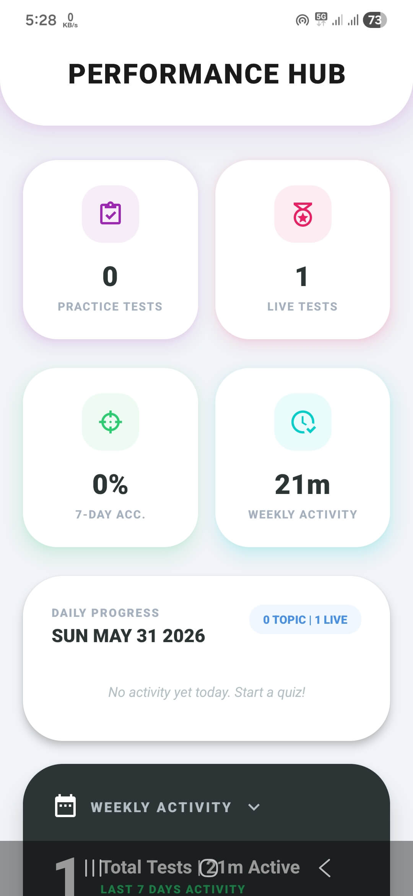
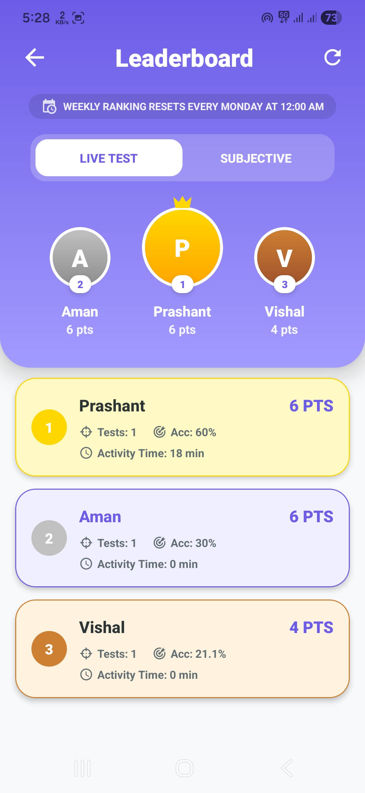
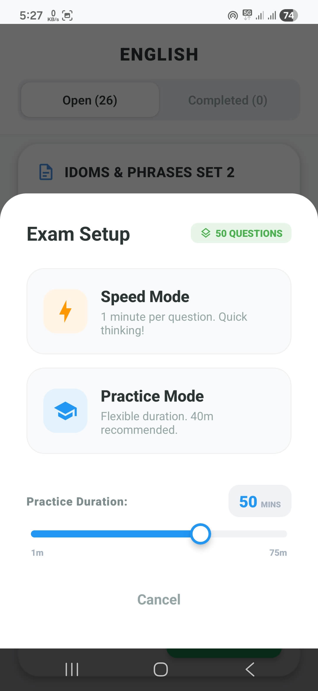
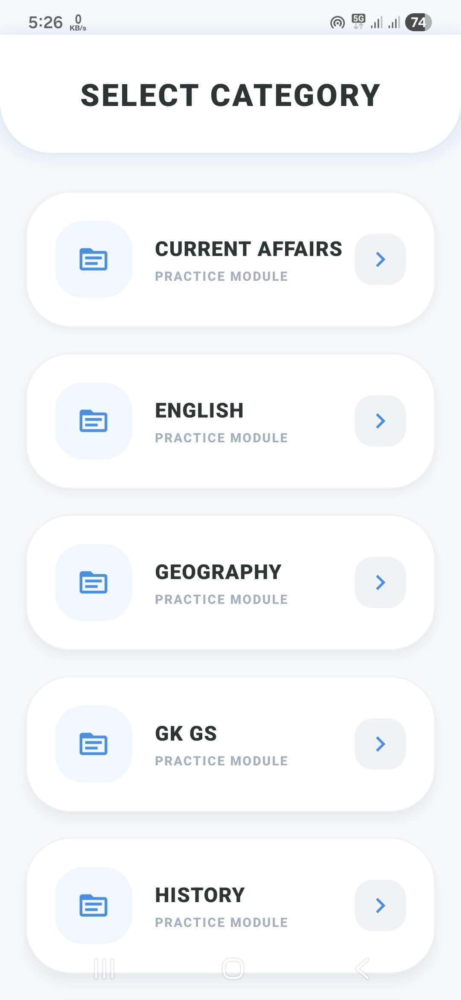
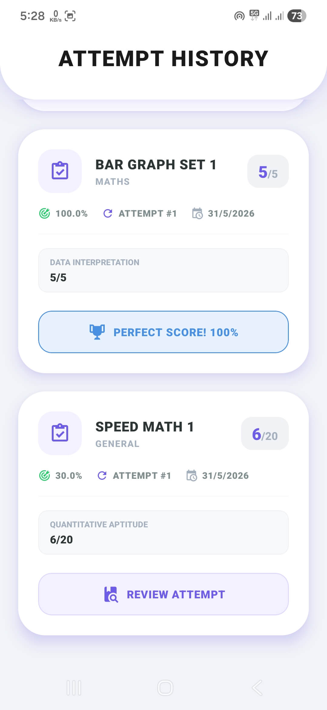
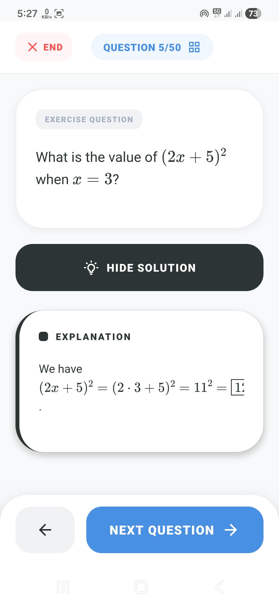
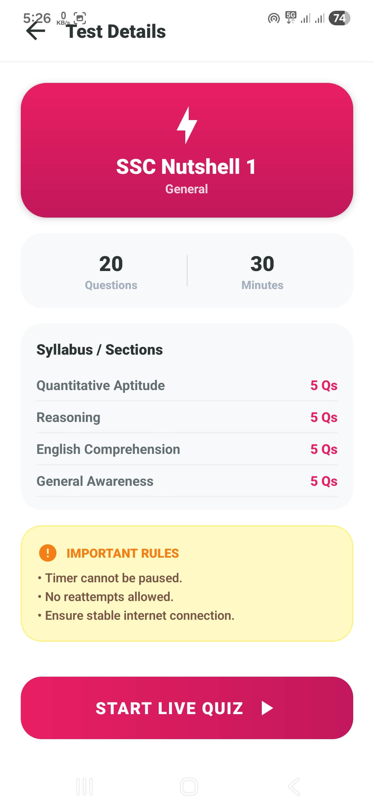
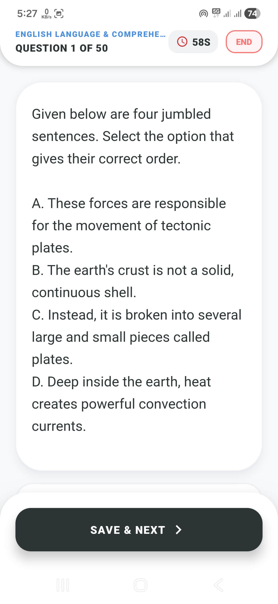
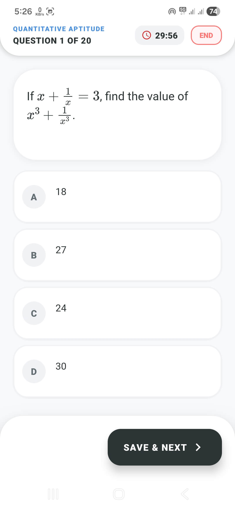

<<<<<<< HEAD
# vgyan
A learning app for the preperation of competative exams.
=======
<p align="center">
  
</p>

<h1 align="center">🎓 VGyan</h1>

<p align="center">
  <strong>The Ultimate Learning Companion for Indian Competitive Exams</strong>
  <br />
  <i>Empowering students with speed, precision, and deep conceptual clarity.</i>
</p>

<p align="center">
  
  
  
  
</p>

---

## 🌟 The Vision

**VGyan** is a high-performance, mobile-first learning ecosystem designed to tackle the rigorous demands of Indian competitive exams (UPSC, SSC, Banking, Railways, and more). It provides a seamless, offline-ready environment that utilizes GitHub as a serverless backend to deliver content, synchronize student progress, and maintain real-time global rankings—all with zero server maintenance and maximum data privacy.

---

## 🚀 Premium Features

*   **⚡ 1-Second Blitz Mode:** A unique "Lightning Bolt" mode that gives you exactly one second per question. Perfect for building the instinctive recall required for high-speed exams.
*   **🧠 Mastery Learning Hub:** Structured exercises featuring topic-wise questions with detailed, step-by-step logic and visual diagram support.
*   **🔄 Intelligent Cloud Sync:** A robust synchronization engine that handles user progress, analytics, and custom settings across devices using GitHub repository sharding.
*   **📊 Insightful Analytics:** Dynamic performance tracking that visualizes subject-wise accuracy, time management, and daily engagement metrics.
*   **🏆 Community Leaderboard:** A global ranking system that drives motivation by allowing students to see their percentile standing against peers nationwide.

---

## 📱 App Walkthrough

### 🏠 The Core Hub & Intelligence Analytics
The Dashboard is designed for "Focus First" navigation. It provides an immediate snapshot of your identity and sync status.

<p align="center">
  
  
  
</p>

*   **Smart Dashboard:** Features a floating sync button that glows when new content (exams/exercises) is detected on the cloud. It handles user onboarding with a secure, password-protected GitHub registry.
*   **Performance DNA (Stats):** Our analytics engine parses your attempt history to generate subject-specific heatmaps, showing exactly where you need to focus your revision.
*   **Global Standings:** The leaderboard isn't just a list—it's a real-time motivator that syncs your best performances to the cloud for global recognition.

---

### 📝 Strategic Testing & Mock Series
VGyan offers a sophisticated testing environment that simulates real-world exam conditions with a twist of customization.

<p align="center">
  
  
  
</p>

*   **Dual-Engine Testing:** Choose **Practice Mode** for a standard timer (entire test) or **Speed Mode** for a per-question timer that forces quick thinking.
*   **Subject-Wise Curation:** Exams are pulled dynamically from GitHub and categorized (e.g., Mathematics, General Knowledge, Reasoning) for targeted preparation.
*   **History & Review:** Every attempt is stored locally and backed up to the cloud. You can re-open any past test to see which questions you got wrong, read the correct solutions, and track your improvement.

---

### 📖 Concept Mastery (The Learning Hub)
Don't just memorize—understand. The Learning Hub is built for deep conceptual diving.

<p align="center">
  
  
</p>

*   **Topic-Wise Exercises:** Unlike random quizzes, these are structured modules. You learn a topic, then solve exercises specifically designed to test that concept.
*   **Detailed Solution Blueprints:** Each question in the Learn module comes with a comprehensive explanation. Complex problems often include diagrammatic references (fetched from the remote image base) to provide visual clarity.

---

### ⚡ Competitive Edge (Live Arena)
Join the "Live Test Series" to compete in scheduled national-level mock contests.

<p align="center">
  
  
  
</p>

*   **The Blitz Challenge:** Experience the intensity of the 1-second-per-question limit. It's designed to eliminate hesitation and sharpen your exam-day reflexes.
*   **Timed Mock Contests:** Standard timed tests that follow the exact pattern of competitive exams, complete with negative marking and section-wise breaks.

---

## 🛠️ Architecture & Tech Stack

VGyan is built on a **Serverless-Sync** architecture:

- **Frontend:** [Expo SDK 50+](https://expo.dev) / [React Native](https://reactnative.dev/)
- **Navigation:** [Expo Router](https://docs.expo.dev/router/introduction/) (File-based, deep-linking enabled)
- **State & Storage:** `AsyncStorage` for offline persistence, synced via a custom GitHub-Sharding logic in `syncService.js`.
- **Backend:** Serverless [GitHub REST API v3](https://docs.github.com/en/rest).
- **Animation:** [React Native Reanimated 3](https://docs.swmansion.com/react-native-reanimated/) for fluid, 60FPS UI transitions.

---

## ⚙️ Quick Start

### 1. Installation
```bash
git clone https://github.com/your-username/vgyan.git
cd vgyan && npm install
```

### 2. Environment Setup
Create a `.env` file in the root directory to enable cloud functionality:
```env
EXPO_PUBLIC_GITHUB_TOKEN=your_secure_personal_access_token
EXPO_PUBLIC_GITHUB_USERNAME=your_github_username
EXPO_PUBLIC_REPO_NAME=quizContentRepo
EXPO_PUBLIC_USERS_REPO_NAME=quizUsersRepo
```

### 3. Run
```bash
npx expo start
```

---

## 📂 Repository Blueprint

<details>
<summary><b>📘 Content Repository Structure (CMS)</b></summary>

```text
├── exam_files/           # JSON-based Mock Tests organized by Category
├── exercise_files/       # Learning Modules with detailed solution fields
├── live_test/            # Scheduled Global/Live Contest data
└── exam_question_images/ # Central CDN for all question illustrations/diagrams
```
</details>

<details>
<summary><b>👤 Users Repository Structure (Database)</b></summary>

```text
├── users.json            # Encrypted/Sanitized User Registry
├── leaderboard_data.json # Aggregated Global Ranking Metrics
└── users_data/           # Individual user progress shards (Secure sharding)
```
</details>

---

## 📄 License

This project is open-source under the [MIT License](LICENSE).

---
<p align="center">
  <i>"Transforming Ambition into Achievement"</i><br>
  <strong>Made with ❤️ by Prashant Chaurasia</strong>
</p>
>>>>>>> master
